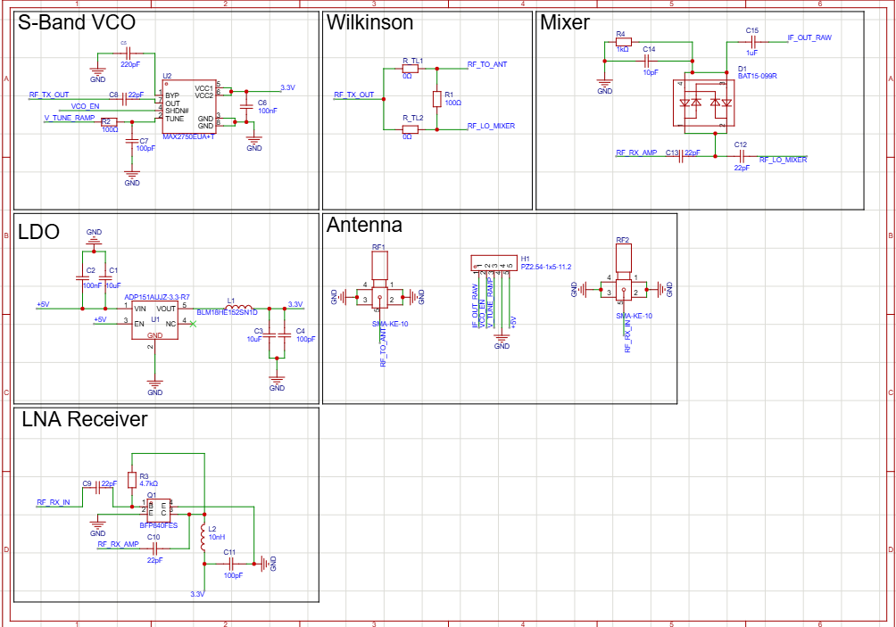
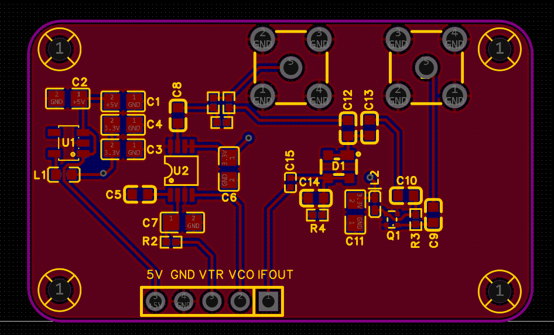
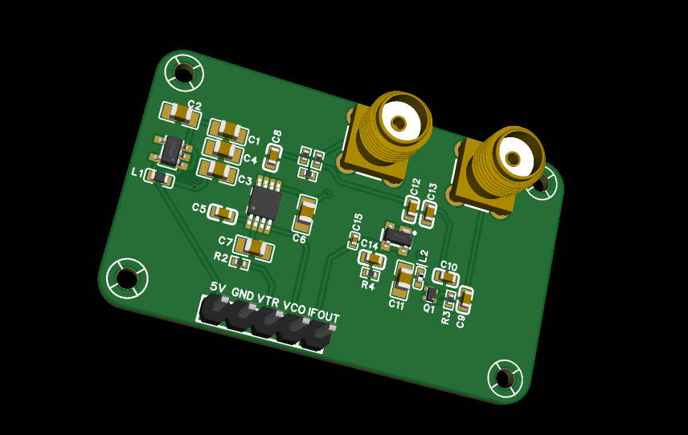
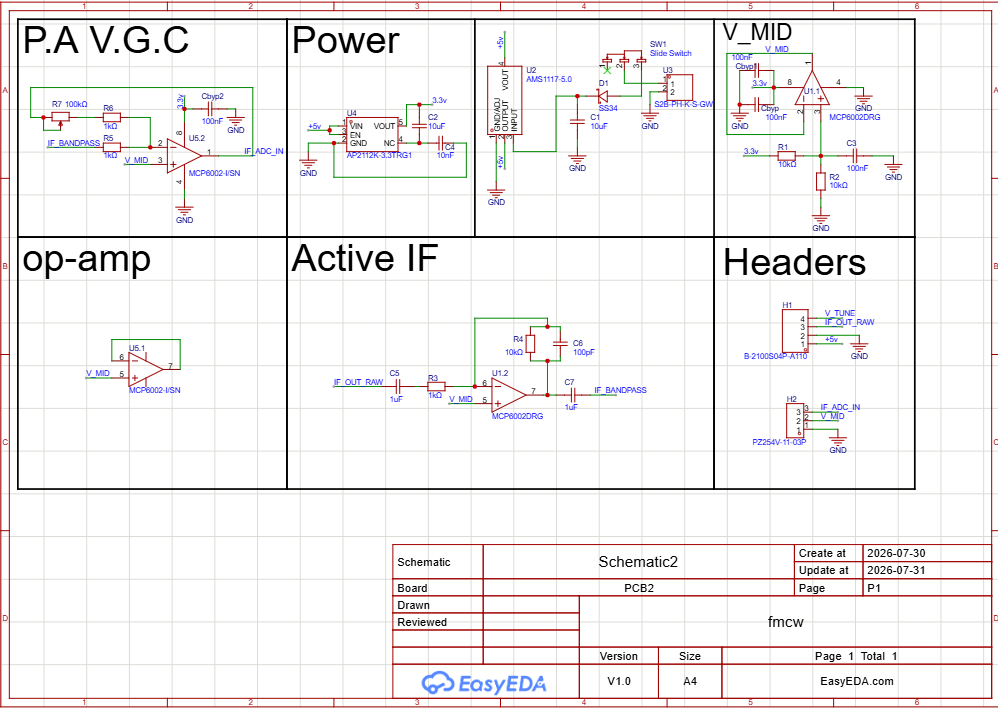
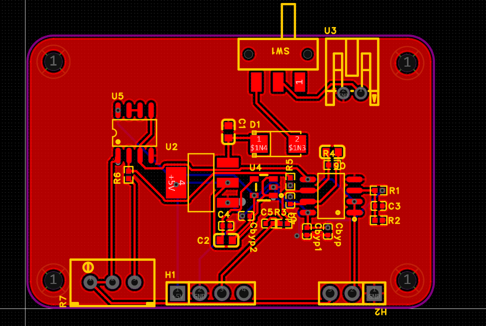
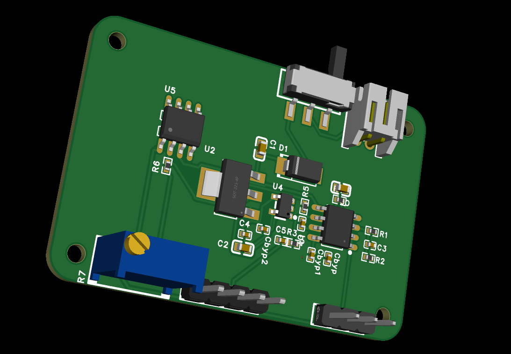
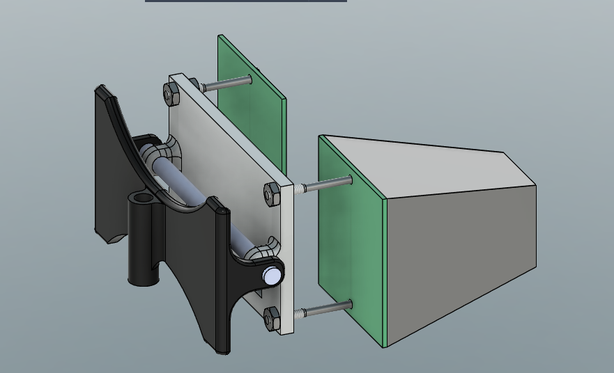
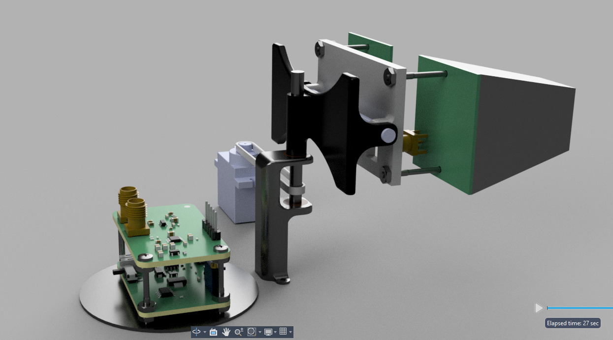
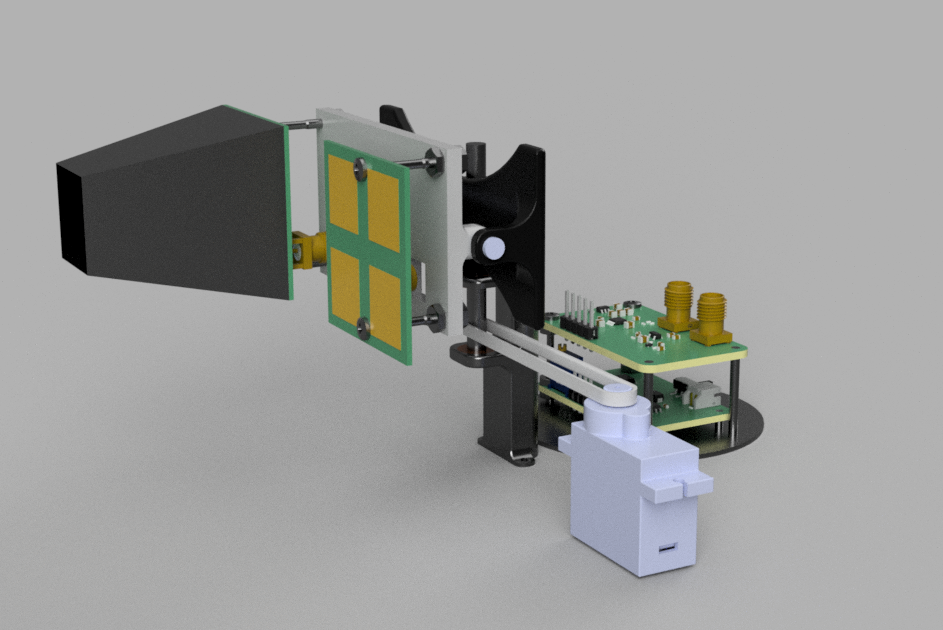
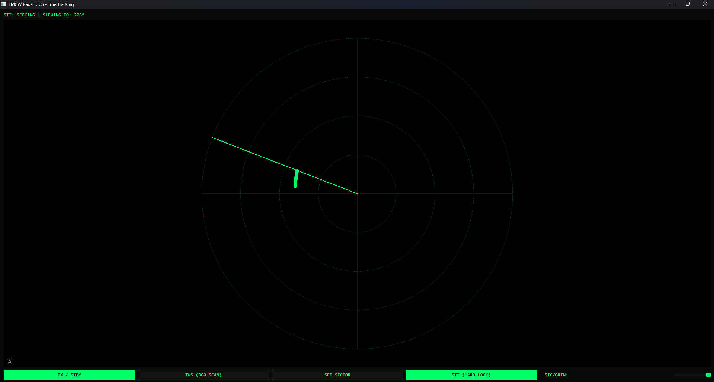

## FMCW RADAR 
This radar use 2.4ghz frequency to track and map 2d terrain its 360 degree and 90 deg up and down 
it composed of 2 pcb board each their job and 2 patch antenna one for transmitting with a horn and one for receiveing the weak signal coming back after being deflected 

## why did i make it 
just for fun and learning its really great i learn the principle of radars and high frequency routing thru it 

## pcb1 
### schema 

### pcb

### 3D render 

## pcb2 
### schema 

### pcb

### 3D render 

### MCU
the microcontroller that is going to control the radar and the gimbal is the esp32 cuz it has two core perfect for multitasking and a 240mhz running rate

# CAD

a structural stiff gimbal to carry all the weight without play it feature a dual bearing for extra stifness and screws and nut 

# Ground control station 
built with pyqt app maker i made it so that its cooler than what you see in the movie 

# BOM 
| Component | Qty | Price |
| :--- | :---: | :--- |
| pcb1 | 5 | $42.00 |
| pcb2 | 5 | $57.00 |
| esp32 | 1 | $2.00 |
| servo | 1 | $3.70 |
| 1kg spool pla | 1 | $20.00 |
| bearing | 4 | $2.00 |
| screws | 100 | $10.00 |
| nuts | 20 | $2.00 |
| headers | 20 | $5.00 |
| belt | 1 | $13.12 |
| sma connectors | 5 | $5.40 |
| **Total** | | **$162.22** |
